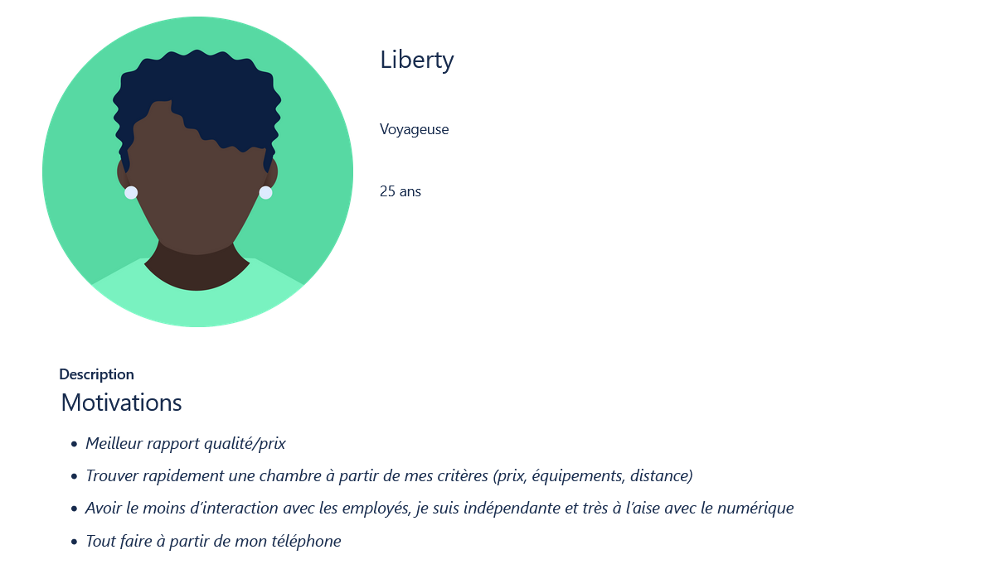
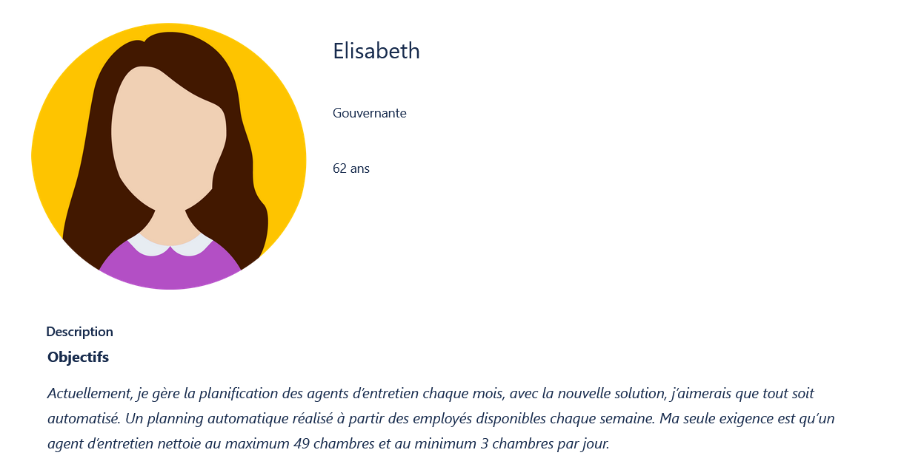
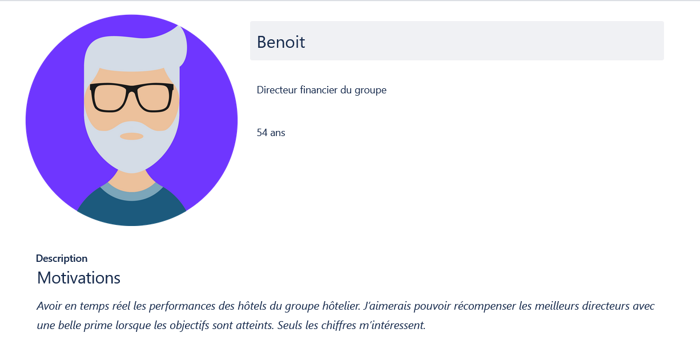
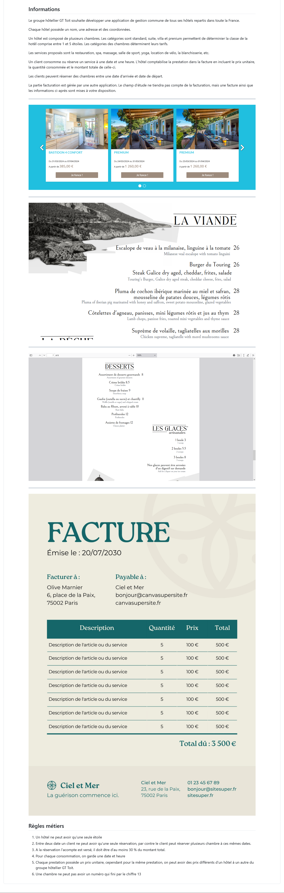

# Projet SCRUM avec PHP en équipe de 3 ou 4

---

## Lancement du projet

1. Désignez une personne dans l'équipe qui aura le rôle de Scrum MASTER (SM) et une autre personne le rôle de Product Owner (PO), par défaut les autres ont le rôle de Developpers (DEV)

### Responsabilités du DEV (on va le faire tous ensemble en même temps)

2. Créez un dépôt sur GitHub
3. Invitez les autres collaborateurs à participer au projet
4. M'inviter avec l'adresse email *contact@tshimini.fr*

### Responsabilités du SM

2. Le ou la SM crée un nouveau tableau sur Trello
3. Le ou la SM invite les autres collaborateurs au tableau
4. Le ou la SM invite m'invite également avec mon adresse *contact@tshimini.fr*

### Responsabilités du PO

2. Le ou la PO crée les tickets du Product Backlog présente ci-après [voir la partie Product Backlog](#product-backlog-pb)

---

### Objectifs du projet

Présentez un ou plusieurs incréments opérationnels lors du ***Sprint Review*** qui aura lieu le ***lundi 29/04/2024 à 11h30***, suivi par un ***Sprint Retrospective*** dans la foulée.

Vous devez :

- Définir en équipe un **objectif de *Sprint*** sur Trello
**N'oubliez pas d'apporter le plus de valeur possible à votre client et la notion du *MVP*(si vous l'avez vu en cours)**
- Respecter la *Definition Of Done* ci-dessous 

---

## Spécifications techniques

- [ ] Gestion de projet avec Trello
- [ ] Ne perdez pas votre temps avec le front (surtout le CSS, utilisez Bootstrap à la place)
- [ ] **Codez en anglais**
- [ ] **Programmez en orienté objet (POO)**
- [ ] Si vous envisagiez de modéliser l'application avec *UML* et/ou *Mérise*, il est indispensable de modéliser **uniquement les concepts qui sont associés à votre objectif de *Sprint*** ou qui permettent d'atteindre celui-ci. Autrement dit, **il n'est pas demandé de modéliser toute l'application voir même de modéliser tout court**. S'il y a modélisation, celle-ci doit aller **dans le sens de votre objectif de Sprint**

---

## *Definition of Done (DoD)*

- Le reste de la *DoD* ci-après

---

## *Product Backlog (PB)*

Le ou la PO constitue le PB ci-après.
Ce PB peut évoluer.

**Libre à vous de partir de cette base et d'en faire ce que vous voulez pour définir un objectif de Sprint. Autrement dit, vous pouvez ajouter/modifier/supprimer des éléments de ce PB**.

---

---

---

---

---

## Personas

L'équipe Marketing du client vous fournit les profils type des futurs utilisateurs.

---

---

---

---

---

---

## Expression des besoins du groupe GTHôtel (anciennement GT Toît)

**Les images ne sont pas contractuelles, elles servent d'exemples**.

## Echantillon des données en JSON fournies par l'hôtel

- [Données en JSON](./sample/)
**PS:** toutes les informations fournies en **JSON**, s'ils doivent être intégrés, ils doivent être faits **de manière automatique**, autrement dit **pas de saisie manuelle**, car ses informations seront régulièrement mises à jour au fur et à mesure.